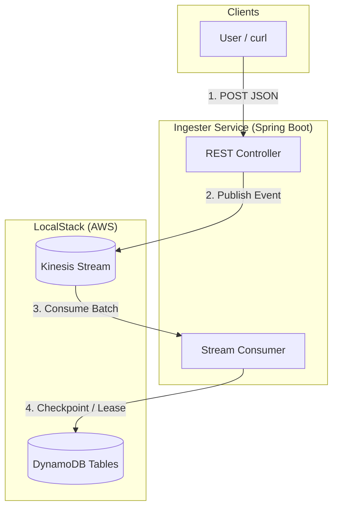
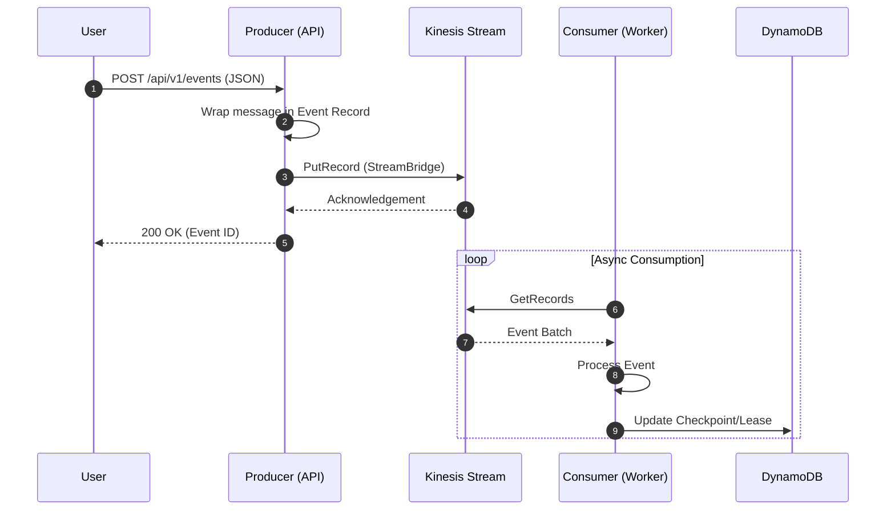

# 🏗️ Architecture

Stream Weaver simulates a high-throughput event pipeline using LocalStack to mirror AWS services.

## Event Flow

## Interaction Sequence

## Infrastructure Resources

Defined in `infra/shared/main.tf`:

| Resource           | Name                   | Purpose                                                    |
|:-------------------|:-----------------------|:-----------------------------------------------------------|
| **Kinesis Stream** | `stream-weaver-events` | Buffers incoming events from the producer API.             |
| **DynamoDB Table** | `StreamWeaverMetadata` | Stores checkpoints for the Kinesis consumer binder.        |
| **DynamoDB Table** | `StreamWeaverLocks`    | Manages distributed locks for consumer group coordination. |
